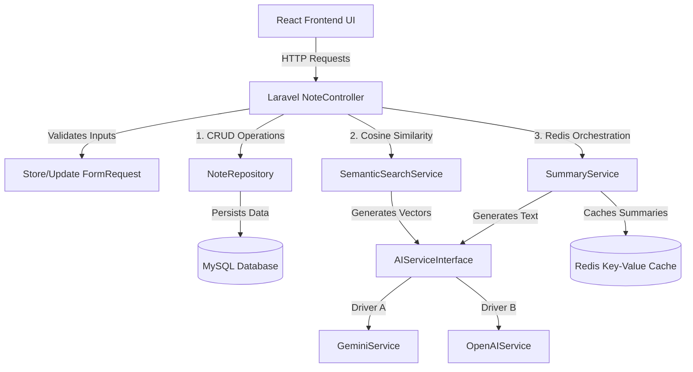

# Submission Package: AI-Powered Notes Management System

Dear Instructor,

Thank you for reviewing my submission for the PHP Backend + AI Development role. 

This folder contains the complete documentation, setup instructions, architectural explanations, and guidance on navigating the files and screenshots for this project.

---

## Folder Contents
1. **[INSTRUCTOR_GUIDE.md](file:///D:/ai-notes-system/submission-package/INSTRUCTOR_GUIDE.md)**: This file (complete setup & architecture breakdown).
2. **`screenshots/`**: Directory where project screenshots are saved. (Please refer to the **Screenshots Reference** section below).
3. **[README.md](file:///D:/ai-notes-system/README.md)**: Main developer-focused README for the repository.
4. **[api_examples.http](file:///D:/ai-notes-system/api_examples.http)**: REST client examples for manual API testing.

---

## 1. Quick Start Setup Guide (Docker)

To run the application locally on your machine, you only need to have **Docker & Docker Desktop** installed.

### Step-by-Step Execution:
1. **Configure Environment Variables**:
   Open the file `backend/.env` (or copy `backend/.env.example` to `backend/.env`) and configure the Google Gemini API key:
   ```env
   AI_PROVIDER=gemini
   GEMINI_API_KEY=your_actual_google_ai_studio_api_key
   GEMINI_MODEL_EMBEDDING=gemini-embedding-001
   GEMINI_MODEL_SUMMARY=gemini-2.5-flash
   ```
2. **Spin Up the Docker Containers**:
   From the root directory (`ai-notes-system`), run:
   ```bash
   docker-compose up -d --build
   ```
   *This will launch PHP 8.2-FPM, Nginx, MySQL, Redis, and React (Vite) in background containers.*
3. **Install Backend Dependencies & Database**:
   Run the following setup command chain in the app container:
   ```bash
   # Install PHP packages
   docker-compose exec app composer install
   
   # Set the Laravel application key
   docker-compose exec app php artisan key:generate
   
   # Run migrations and setup empty database tables
   docker-compose exec app php artisan migrate
   ```
4. **Access the Applications**:
   * **Frontend UI Dashboard**: [http://localhost:5173](http://localhost:5173)
   * **API Core Endpoint**: [http://localhost:8000/api](http://localhost:8000/api)
   * **Interactive Swagger UI API Docs**: [http://localhost:8000/api/documentation](http://localhost:8000/api/documentation)
     * *Troubleshooting Note*: If Swagger UI displays "Failed to load API definition" due to a cached browser redirect or 404 from before the Swagger file was generated, perform a **hard refresh** (`Ctrl + F5` or `Cmd + Shift + R`) or open the page in an **incognito window** to clear the cache and load the freshly compiled `/docs` API definition.

---

## 2. Testing the Application

### Running Automated Test Suites:
Run the PHPUnit test suite inside the app container:
```bash
docker-compose exec app php artisan test
```
* **Unit Tests (`tests/Unit/SemanticSearchTest.php`)**: Asserts mathematical properties of the Cosine Similarity calculation (orthogonal, opposing, zero, and identical vectors).
* **Feature Tests (`tests/Feature/NoteApiTest.php`)**: Asserts full REST CRUD behaviors, request validations, throttling, cache invalidation, and mocked AI service bindings.

---

## 3. Project Architectural Flow

The project is structured under **Clean Architecture** patterns, leveraging the **Service-Repository Pattern** to maintain decoupled layers:



### Key Components:
* **[AIServiceInterface.php](file:///D:/ai-notes-system/backend/app/Services/AIServiceInterface.php)**: The contract defining AI operations. It enables switching AI providers globally using a single setting in `.env` without modifying downstream controllers.
* **[GeminiService.php](file:///D:/ai-notes-system/backend/app/Services/GeminiService.php)**: Integrates the 100% free Google Gemini API. Handles vector generation (`gemini-embedding-001` with custom 768 dimension truncation) and summaries (`gemini-2.5-flash`). Features offline self-healing fallback mechanisms. Note that for `gemini-2.5-flash`, the output token limit is configured to `1024` to avoid truncating summaries when the model consumes budget for reasoning/thinking tokens.
* **[SemanticSearchService.php](file:///D:/ai-notes-system/backend/app/Services/SemanticSearchService.php)**: Computes the query vectors and ranks database notes using high-dimensional Cosine Similarity formulas.
* **[SummaryService.php](file:///D:/ai-notes-system/backend/app/Services/SummaryService.php)**: Generates 3-5 line note summaries. Caches the output in **Redis** with a 24-hour TTL and invalidates the cache automatically if the note is edited or deleted.

---

## 4. Security Implementations

* **SQL Injection Prevention**: All database interactions are built using Laravel's Eloquent ORM, which compiles query parameters into prepared statements, neutralizing injection vectors.
* **Input API Validations**: Incoming JSON payloads are strictly validated using Form Requests ([StoreNoteRequest.php](file:///D:/ai-notes-system/backend/app/Http/Requests/StoreNoteRequest.php)).
* **API Throttling**: Global middleware limits API requests to 60 requests per minute per IP to protect server resources.

---

## 5. Screenshots Reference (Inside `screenshots/` Folder)

Please review the images saved inside the `screenshots/` directory representing active features:

1. **`dashboard.png`**: Display the main dashboard UI, displaying notes fetched from the MySQL database with pagination.
2. **`create-new-notes.png`**: Shows the creation page used to validate inputs and save new notes.
3. **`edit-notes.png`**: Shows the note editing interface where updates are typed and saved.
4. **`semantic-search-features.png`**: Demonstrates the AI vector search in action, showing similarity scores and matching notes ranked by relevance.
5. **`ai-note-summary.PNG`**: Displays the note summary overlay pop-up modal containing a concise, AI-generated summary from Gemini.
6. **`swagger-api-explorer.png`**: Displays the Swagger UI API Explorer showing documentation and endpoint parameters.
7. **`PHPUnit_Test_Results.PNG`**: Displays the terminal output of running `php artisan test` with all 9 test suites passing.
